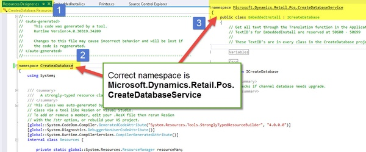

After CreateDatabase project upgrade (from Retail SDK), project fails to compile with error:

> ‘LSRetailPosis.Resources’ does not contain a definition for ‘DatabaseAccessUserGroupDescription’ (CreateDatabase\EmbeddedInstall.cs)

===

### Steps worked for me

1. Find Resources.Designer.cs class in CreateDatabase project
2. Change its namespace to be equal to EmbeddedInstall class namespace.

As you can see on below picture, Resources class had CreateDatabase namespace, when correct namespace was Microsoft.Dynamics.Retail.Pos.CreateDatabaseService .

