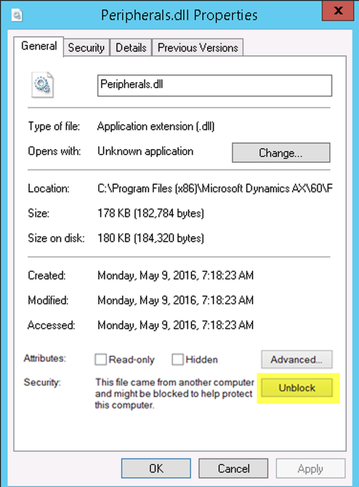

Sometimes when you install a package with DLL files to target POS PC, you can find out, POS does not load and use your DLL files. This can be caused by Windows Security that blocks the files.

This is an article about ‘Unblock’ procedure, I really love it and it saved my life multiple times: [Moving POS DLLs from one machine to another causes the file to be blocked](https://blogs.msdn.microsoft.com/axsupport/2014/01/29/moving-pos-dlls-from-one-machine-to-another-causes-the-file-to-be-blocked/)

===

In some cases, after you click ‘Unblock’ button, DLL file remains blocked. If you transferred files as an archive (zip, for example), you should click ‘Unblock’ for full archive before extracting DLL files. Usually such ‘Unblock’ works and when you extract files, Windows Security will not block them.

