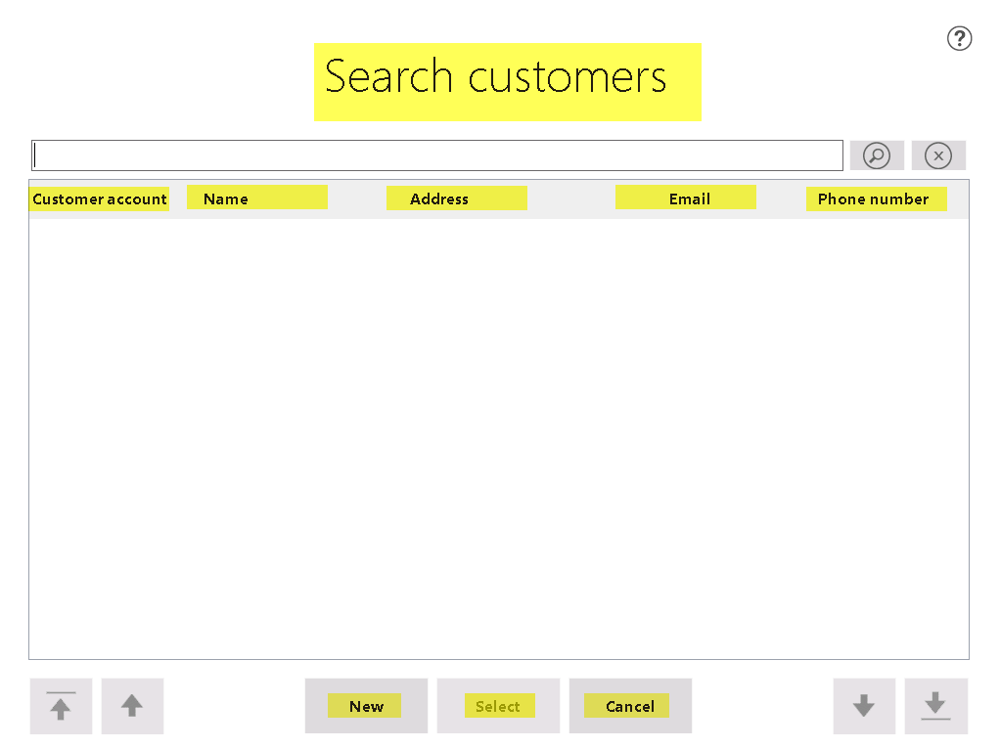
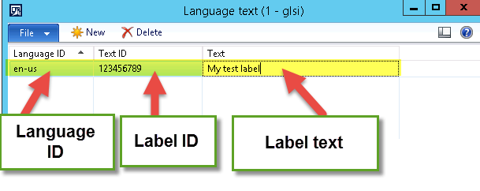
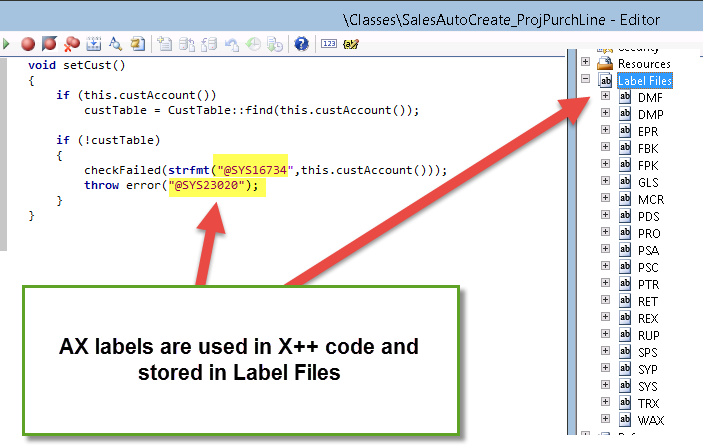

Today I would like to speak about **POS** and **MPOS** labels.

===

### Where does standard POS (MPOS) use labels?

POS uses labels in all forms to display text translated to different languages.

For example, let’s open **‘Customer search’** form: **‘Search customers’, ‘Customer account’, ‘Name’, ‘Address’, ‘Email’, ‘Phone number’, ‘New’, ‘Select’, ‘Cancel’** texts are POS labels.

### Can I create custom POS labels?

Yes, you can. Refer to the following blog to for sample: [AX FOR RETAIL: MODIFYING POS LABELS AND STRINGS](https://blogs.msdn.microsoft.com/axsupport/2012/01/09/ax-for-retail-modifying-pos-labels-and-strings/)

### What are the main components of POS label?

POS label consists of three main elements:

1. Label ID;
2. Label language;
3. Label text;

**Label ID** is a numeric identifier of the label.

**Label language** is the language of label. When POS starts, it determines UI language and uses the labels of this language for UI (depending on store + worker setup).

**Label text** is a string displayed on POS element (button, column, etc.), where label is used.

### Are POS and AX labels the same?

No, they are not the same: 

+ AX labels are created in AX by developers and stored in label files (in AOT);
+ POS labels are configured in AX ‘Language text’ (Retail > Setup > POS > Profile > Language Text) table. After configured texts are transferred to store database by data distribution jobs.

### Where POS where POS label texts are stored?

They are stored in multiple places:

1. Standard label texts are stored in POS internal resources;
2. Custom label texts are stored in AX table ‘Language Text’.

### My ‘Language text’ table in AX is empty, where can I find POS labels?

Standard POS labels are stored in POS internal resources, they are hardcoded and you cannot change them directly, but you can override the text. Please, refer to the following blog for details: [AX FOR RETAIL: MODIFYING POS LABELS AND STRINGS](https://blogs.msdn.microsoft.com/axsupport/2012/01/09/ax-for-retail-modifying-pos-labels-and-strings/)

### Why is it important to use POS labels? My customer uses single language and will never need a translation

POS labels make your solution flexible: you give customer freedom to **change label text** only by configuration AND **without POS redeployment.**

If text is a label and customer decides to change it, he/she will need:

1. Go to **Retail > Setup > POS > Profiles > Language text;**
2. Find the label and change its text;
3. Run data distribution job (1090 usually) to update store database.

**If text is hardcoded** in POS code and customer decides to change the text, this will lead to the following actions:

1. Developer changes the text in the code;
2. Developer prepares update package for POS;
3. Update package should be deployed to ALL POSes.

Profits of using the labels are obvious. Change of hardcoded texts actions will take a hell of time and resources. So let’s love labels and make our Customers happy  🙂