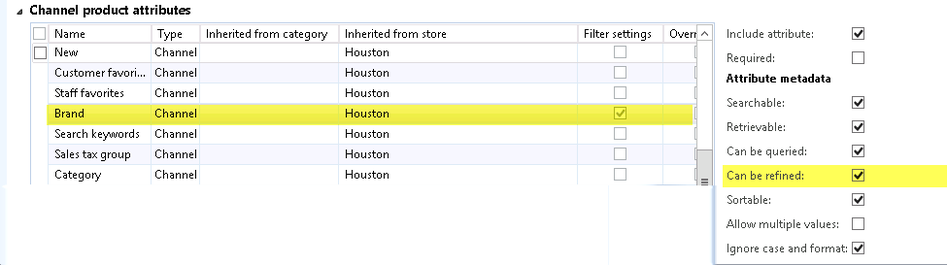
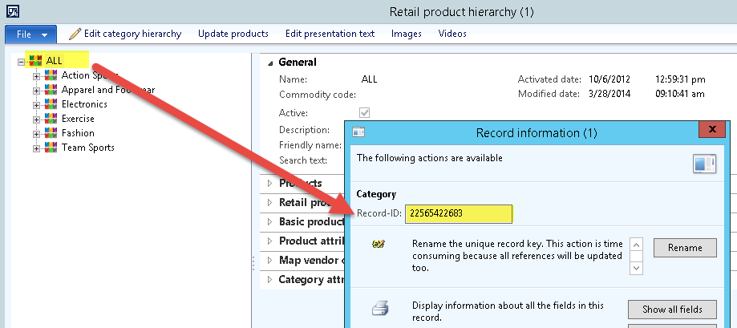
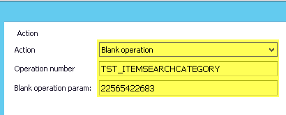
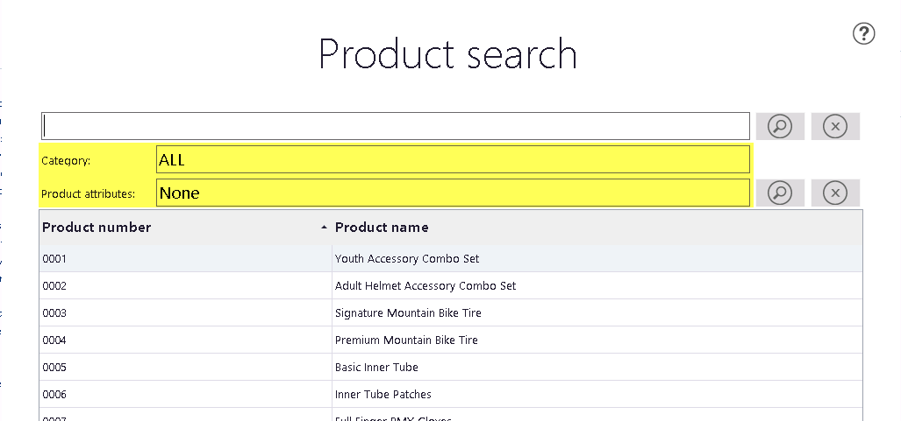
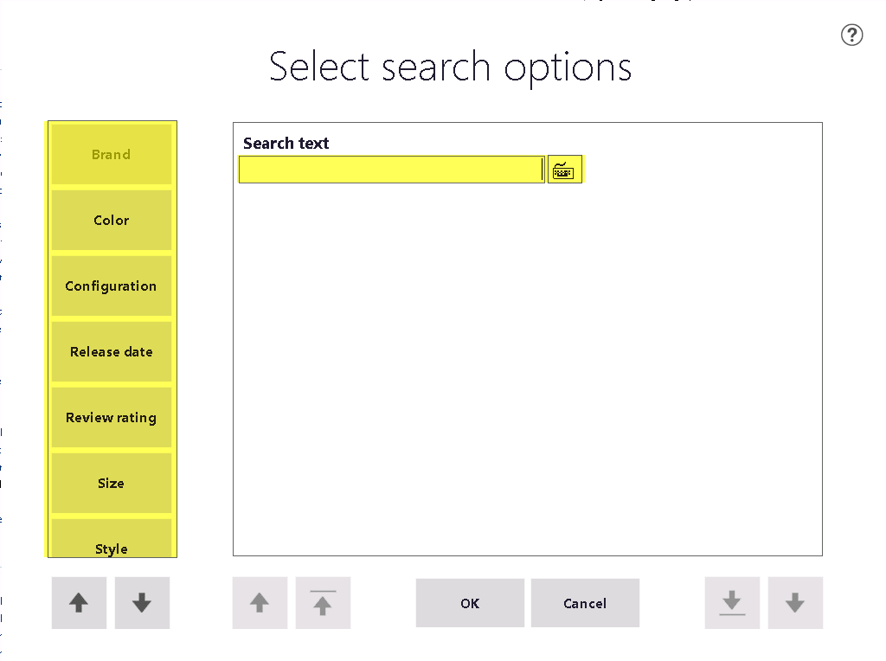
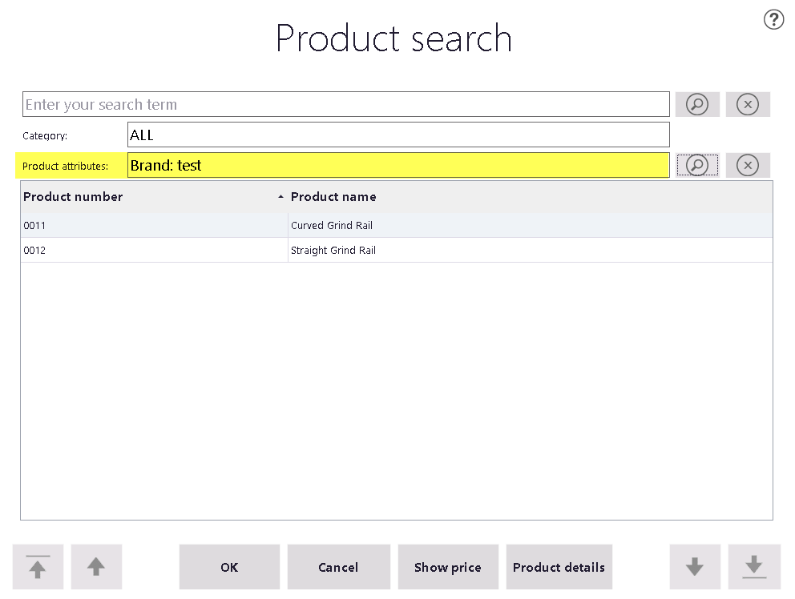
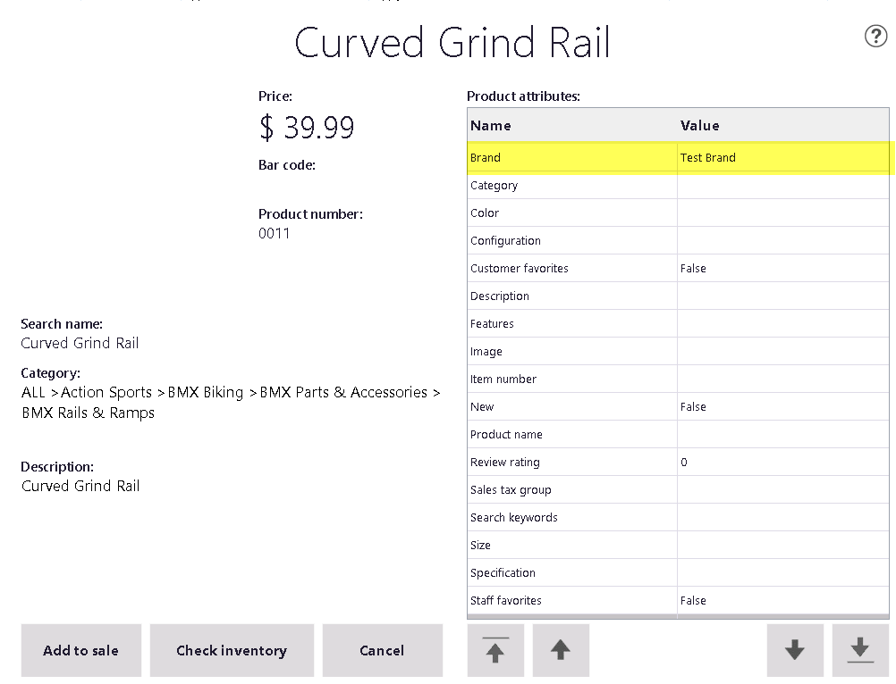
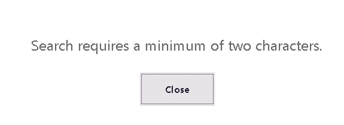
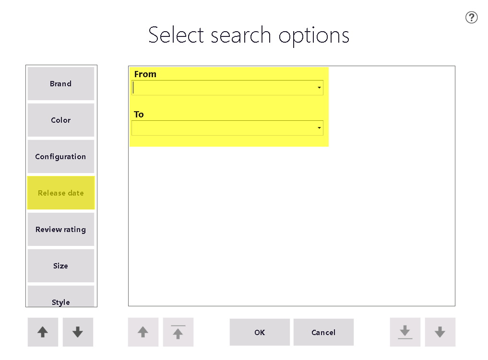

This post will show you the way to enable and use product search by attributes in POS (ePOS).

===

### AX configuration

Configuration of product attributes in AX include two main steps:

1. Configure attribute groups, attributes and attribute values for hierarchies, categories and products.
Very nice explanation is here: ORGANIC AX: PRODUCT ATTRIBUTES
2. Mark all attributes to be used for search as **‘Can be refined’** (we will use new ‘Brand’ attribute as a sample).

3. Assign product attributes to stores.
Technet article can be helpful:STORE PRODUCT ATTRIBUTES
4. Run **1040, 1050** and **1070** jobs to update store databases.

### POS changes

I did not find any standard way to run search by attributes in POS. But we can enable such search by a very small coding.

The main limitations of search by attributes are:

1. It can be executed only within a **SINGLE** product category. This makes impossible to search across different category hierarchies
2. It is performed only in local store database; call HQ (AX) is not possible.

### Steps

1. Add new ‘Blank operation’ for POS. Code for operation is shown below. This blank operation runs standard **‘Item search’** operation, but with a **parameter.** The parameter should contain **Rec ID of product category.**

    public void BlankOperation(IBlankOperationInfo operationInfo, IPosTransaction posTransaction)
    {
    switch (operationInfo.OperationId.ToUpperInvariant())
    {
        case "TST_ITEMSEARCHCATEGORY": 
                this.Application.RunOperation(PosisOperations.ItemSearch, operationInfo.Parameter);
            operationInfo.OperationHandled = true;
            break;
        }
    }

2. Add new button to POS layout

### Results

A. When POS starts item search with **not empty category**, it will show **Search by attributes** buttons: **Category** and **Product attributes**

B. When you click on **magic glass** , the list of product attributes configured as **Can be refined** for current store will be shown.
You can specify search values for multiple attributes, they will be applied as **AND** logical condition.

C. Search shows found products

D. If you click on **Product details** button, the list of attribute values will be shown.

E. **Minimum number of search chars** to enter is **two (2)**. When you try to enter a single character, you will receive the error: 

> Search requires a minimum of two characters.

F. Search by date attributes is disabled by default: AX does not allow marking date attributes as ‘Refinable’. However, if to change AX code a bit, search by date attributes will be possible.

