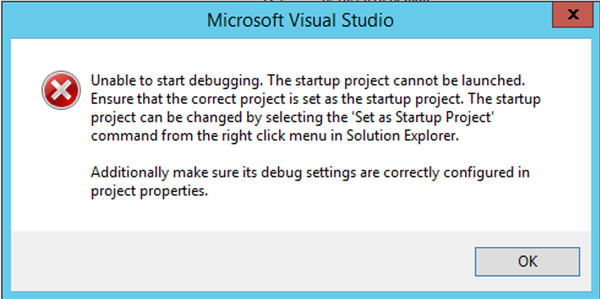

### Description

When trying to start MPOS client project in Debug mode, error **“Unable to start debugging…”** is thrown by Visual Studio. My Visual Studio is 2015, full version number is 14.0.25420.01 Update 3.

===

### Steps worked for me

1. Go to **Debug** > Options
2. Select **Projects and Solutions** tab
3. Uncheck flag **‘Show output window when build starts’**
4. Restart Visual Studio

### Error details

> Unable to start debugging. The startup project cannot be launched. Ensure that the correct project is set as the startup project. The startup project can be changed by selecting the ‘Set as Startup Project’ command from the right click menu in Solution Explorer. Additionally make sure its debug settings are correctly configured in project properties. 

&nbsp;

