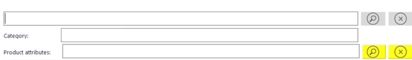

This blog post will show you the way to change color of DevExpress button of class **SimpleButton.**

According to DevExpress support, to apply color to SimpleButton, button should have “Flat”, “UltraFlat”, or “Style3D” style.

===

    var simpleButton = new DevExpress.XtraEditors.SimpleButton();
    var buttonColor = System.Drawing.Color.Yellow;
    simpleButton.ButtonStyle = DevExpress.XtraEditors.Controls.BorderStyles.Flat; 
    simpleButton.Properties.Appearance.BackColor = color;

