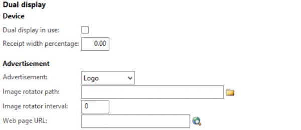
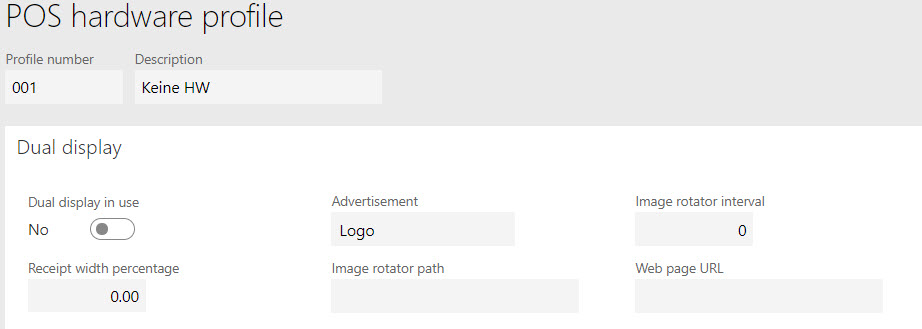
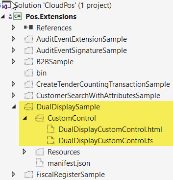
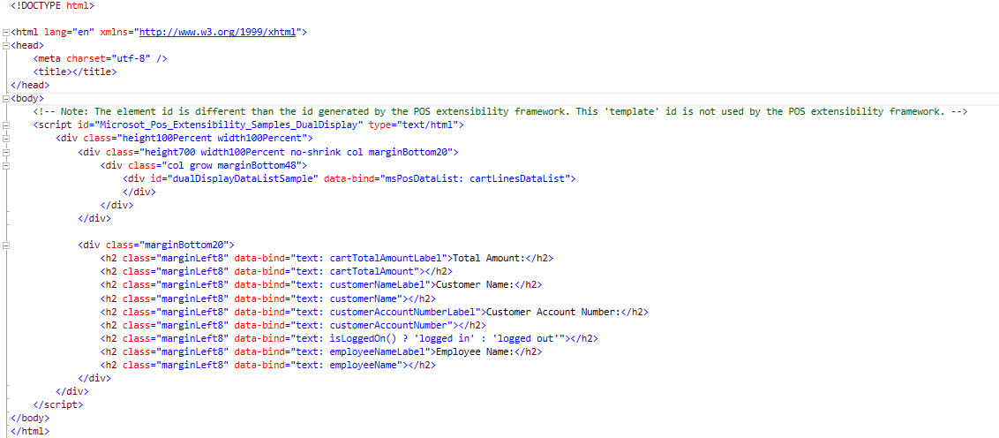

### AX2012 Dual display

Dual display is retail POS functionality that exists from AX2012. There were a lot of settings you could configure, including advertisement, image rotator, web page URL, etc.

===

### Dynamics 365 Dual display

If we move to Dynamics 365, we still see the same settings available – and we expect all dual display functionality remains the same. In reality, these settings do not have any relation to Dynamics 365 Dual display – they are shown on Hardware profile for backward compatibility.

### How to enable Dual Display in Dynamics 365?

Developer help is required to enable Dual display functionality: very simple version of Dual display view is a part of standard POS Extensions – DualDisplaySample.

### What functionality does basic Dual Display have in Dynamics 365?

Below you can see HTML of a standard Dual Display view. It contains:

1. The list of products in cart
2. Some customer details
3. Some employee details
4. Total amount

If your Customer needs more details on dual display, work with developers to design a new layout.

### Technical details

Retail version: 7.3.11971.63734