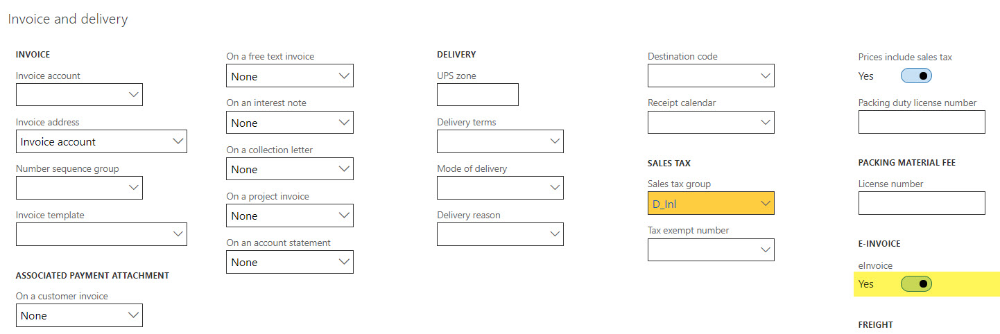

### Description

When retail statement is posted, created sales order cannot be invoiced. The following error appears: 

> Field ZIP/postal code, primary contact, country, city, street, etc. must be filled in. Posting of order canceled.

===

### Reason

Customer of the sales order has ‘eInvoice‘ flag enabled.
When eInvoice is active, primary contact, country, city, street and ZIP/postal code of the sales order delivery address become mandatory.

