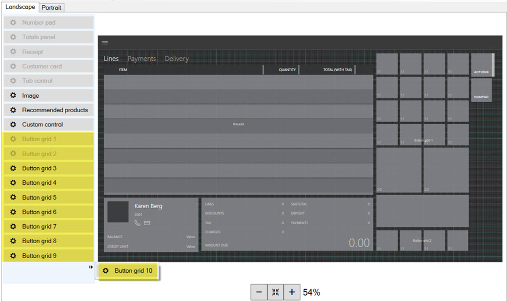
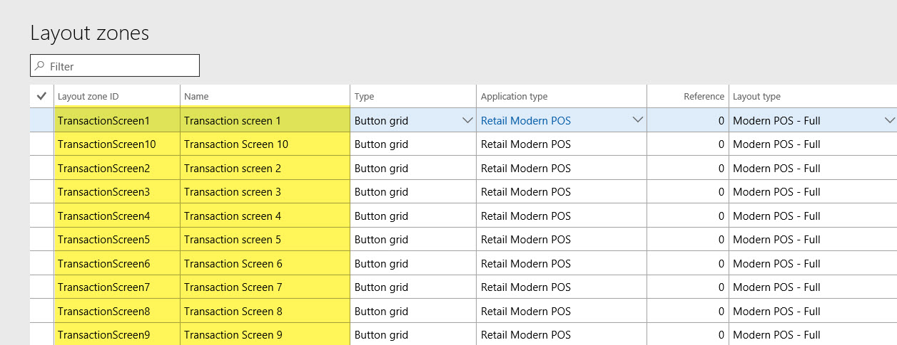

Retail version: 7.3.11971.64069

From AX 2012 the maximum number of button grids allowed on POS screen was limited to five (5).
In Dynamics 365 POS can have up to ten (10) button grids on ‘Transactions screen’ – great improvement for Retailers.

===

