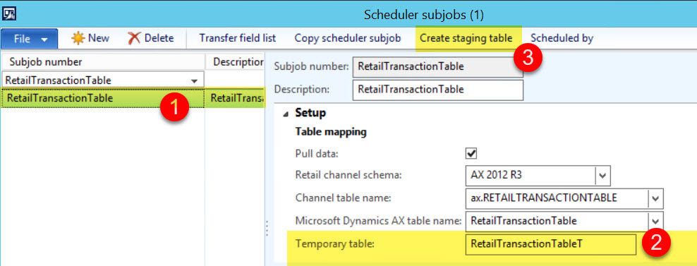

### Description

When new fields are added to some existing upload retail tables (from P-jobs), if you run upload job, you can notice that new fields remained empty. How to solve this?

===

### Solution

Every upload table has related temporary table, for example: RetailTransactionTable  => RetailTransactionTableT, RetailTransactionSalesTrans  => RetailTransactionSalesTransT (or RetailTransactionSalesTransX). Data upload in AX happens like: data package => temporary table => final table.

This makes needed to refresh temporary table when you add new fields to a final upload table – button **‘Create staging table‘** on **‘Scheduler subjobs’** form will do this for you.

