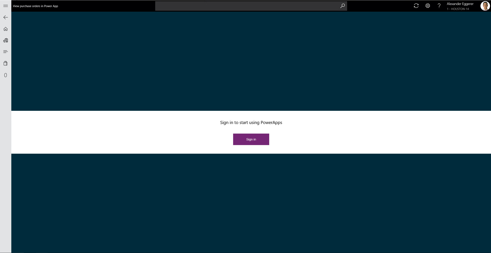
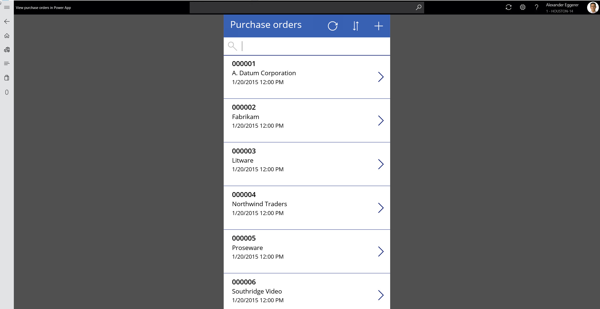
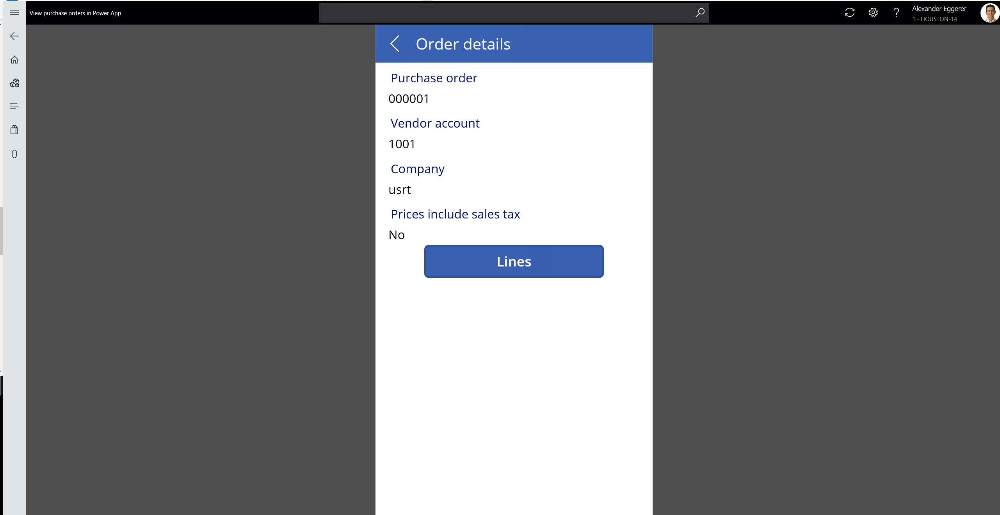

Can we integrate PowerApp with Dynamics 365 Finance and Operations Retail MPOS or CPOS? This question appears during every Retail training.

===

Let’s test together:
1. Create PowerApp to view and edit purchase orders from Retail POS 
2. Embed PowerApp into Retail POS
3. Call PowerApp from Retail POS
4. Check how PowerApp authentication will be handled

### How embedded PowerApp looks in POS

Current ‘Purchase order view/edit’ PowerApp was built for ‘Mobile’ size only, so it is not displayed Full screen. 

### Create PowerApp to view and edit purchase orders from Retail POS

This point is independent from Dynamics 365 POS. We follow general guides how to connect PowerApp to Dynamics 365 datasource and create an app with required functionality using PowerApp Designer.

When PowerApp is ready, we publish it, so it becomes visible for other users in Tenant.

### Call PowerApp from Retail POS

When PowerApp is published, we receive URL to open this App in any browser. To call PowerApp from POS:

1. Create new Retail operation ‘View purchase orders’ in D365
2. Add button to POS button grid to execute this operation
3. Create POS modification that will open a new view inside POS with embedded PowerApp

### Check how PowerApp authentication will be handled

PowerApp requires authentication.When you first time open it, it will ask you to sign in using Azure Active Directory credentials. 

##### Why cannot I have PowerApp without authentication?

As soon as PowerApp is published, it receives global URL. Without authentication any person having this URL would be able to open a PowerApp and view/edit your data. 

##### Should I create a separate account for every worker in store to access the PowerApp?

Depends. It should be at least one account for all workers. If you would like to share the same logon details across many workers, you can do so.

##### Which legal entity is selected as default one? 

PowerApp will use user legal entity by default (from D365 user options). 